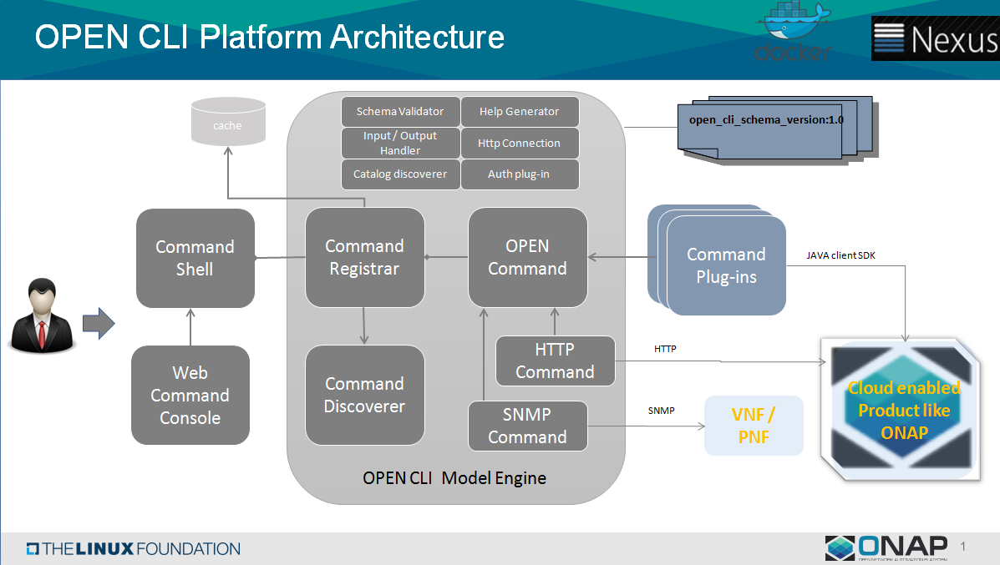

.. This work is licensed under a Creative Commons Attribution 4.0 International License.
.. http://creativecommons.org/licenses/by/4.0
.. Copyright 2017 Huawei Technologies Co., Ltd.

.. _cli_architecture:

CLI architecture
================

Following diagram shows the high-level architecture of ONAP CLI.

* **Command Registrar** :  Registrar keeps track of the commands registered in ONAP CLI and when user invokes the command, it identify
  the corresponding command route the request to that command plug-in.

* **Command Discoverer** : Discoverer discovers the commands both in plug-in format and YAML and automatically register them into Registrar.

* **Command Plug-ing** : Implement the command as plug-in. More details :ref:`cli_developer_guide`

* **HTTP Command** : Plug-in for implementing all Rest based command as YAML without any coding.

* **Command Shell** : Provides the interactive command line console from Linux

* **Web Command Console** : Provides the interactive command line console from web-browser
