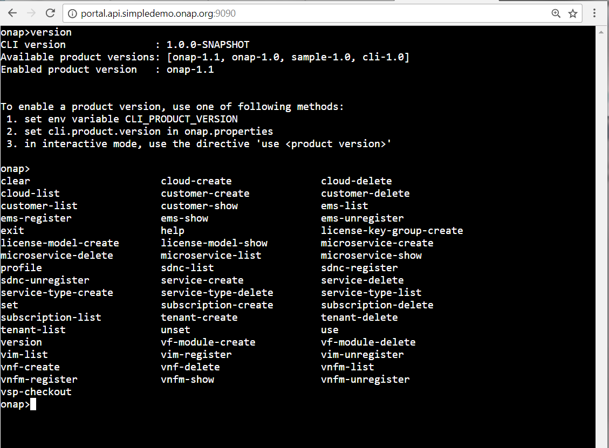

.. This work is licensed under a Creative Commons Attribution 4.0 International License.
.. http://creativecommons.org/licenses/by/4.0
.. Copyright 2017 Huawei Technologies Co., Ltd.

.. _cli_console:

CLI Console
===========

Please install the CLI by following guidelines provided in :ref:`OOM_and_HEAT_based_deployment`

After installation, CLI can be used in following form:

Linux Command Shell
-------------------
It is available when user has access to the server where CLI is installed using zip or docker container.
In this mode, user can use CLI in scripting mode or interactive mode as mentioned in the User Guide.

.. image:: images/portal-cli-shell.png

Web Command Console
--------------------
Once CLI is installed using docker container, user could access the web console by using the url http:<<cli-host-server>:30260

Here, <cli-host-server> is the IP address of server where CLI container is installed.

