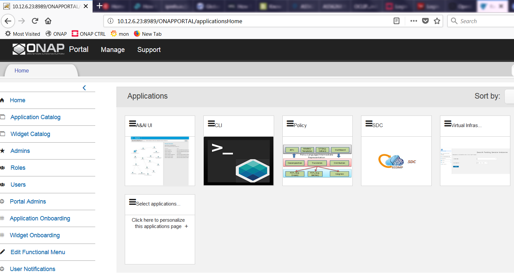
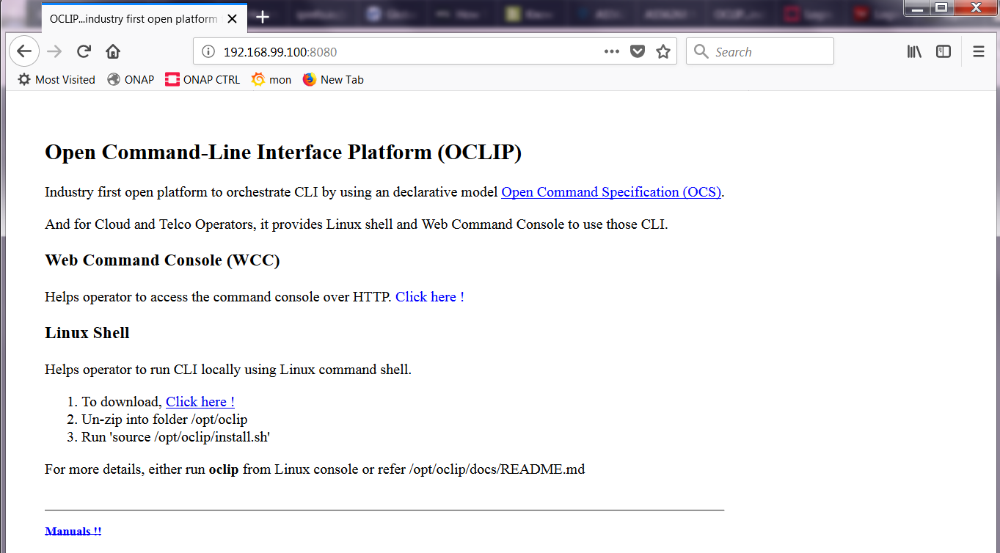

.. This work is licensed under a Creative Commons Attribution 4.0 International License.
.. http://creativecommons.org/licenses/by/4.0
.. Copyright 2017 Huawei Technologies Co., Ltd.

.. _cli_installation_guide:

CLI installation guide
======================

ONAP CLI is delivered in following formats:

* Nexus ZIP artifact
* Docker image

And it could be installed by following one of the approaches given below:

Using install.sh
----------------

Please follow the instructions given below, for installing CLI using install.sh.

1. Download install.sh from here_. to /tmp

.. _here: https://gerrit.onap.org/r/gitweb?p=cli.git;a=blob_plain;f=deployment/zip/installer/install.sh;hb=refs/heads/master

2. Run command

.. code-block:: bash

   source /tmp/install.sh

3. Verify the installation by running following command.

.. code-block:: bash

   onap -v

4. For details, see :ref:`cli_user_guide`

Using Portal CLI app
--------------------

Please follow the instructions given below, for installing CLI from portal.

1. After installing Portal, ONAP CLI will be available as Portal application as shown below:

2. Click on CLI application and it will show the following page and download the CLI as reported in this page.

3. After downloading, please follow the instruction given in this page to install ONAP CLI.

4. Verify the installation by running following command

.. code-block:: bash

   onap -v

5. For details, see :ref:`cli_user_guide`

Using docker image
------------------

Please follow the instructions given below, for installing CLI using docker image.

1. Download the cli docker image

.. code-block:: bash

  docker login -u docker -p docker nexus3.onap.org:10001
  docker pull nexus3.onap.org:10001/onap/cli

2. Verify the installation by running following command

.. code-block:: bash

   docker run onap/cli onap -v

3. For details, see :ref:`cli_user_guide`

